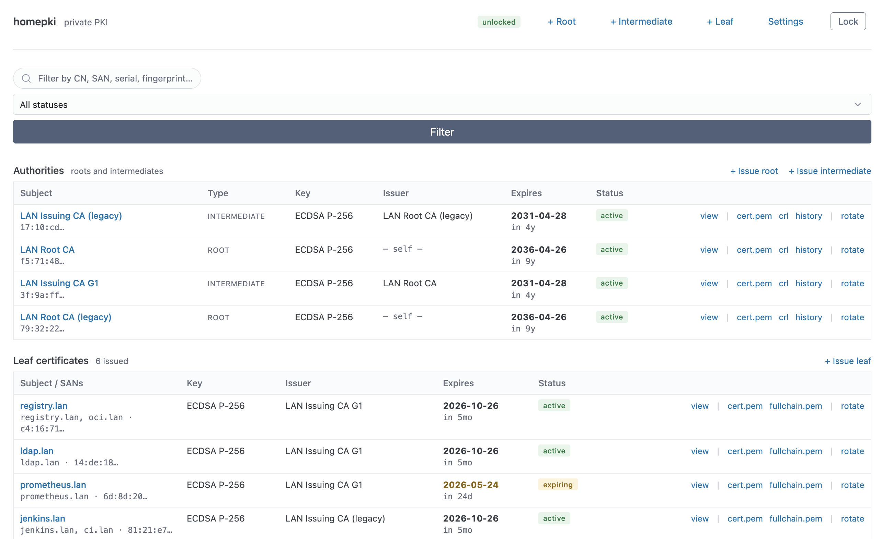

# homepki

A small self-hosted **web app** for running your own private TLS
certificate authority. Issue, rotate, revoke, and download certs;
configure deploy targets; manage the passphrase — **all from a
browser**. There is no `homepki` CLI to install: one Docker container
runs the server and serves the UI.



## Why you might want this

**The reason this project exists: HTTPS for [Tailscale](https://tailscale.com/)
nodes.** If you've given your tailnet machines friendly names like `nas`,
`media`, or `pi.tail-scale.ts.net`, Let's Encrypt can't help — those
names aren't in public DNS. But once you trust a homepki root on each
device, every internal service over your tailnet gets real HTTPS without
browser warnings, and the certs use whatever name your devices actually
respond to: short MagicDNS names, `*.lan` aliases, raw tailnet IPs.

The same problem shows up in plain home labs too — a NAS at `nas.lan`,
a router admin page on `192.168.x.x`, a Home Assistant box, a
self-hosted Git server. Let's Encrypt won't issue, browser warnings get
old fast, and `openssl` incantations copied from blog posts have a way
of going sideways.

homepki gives you the missing middle:

- One **root CA** you trust on your devices once.
- **Leaf certs** for individual services, with proper SANs (`nas.lan`,
  `192.168.1.10`, MagicDNS names) and short lifetimes you can actually
  rotate.
- **Deploy targets** that drop the cert and key on disk where nginx /
  Caddy / haproxy expect them, optionally running `nginx -s reload` for
  you afterward.
- A **public CRL endpoint** baked into every cert, so when you revoke
  a cert your trusted devices actually find out.
- Encrypted at rest under a passphrase you choose. Lock the app and the
  in-memory key is wiped; private keys on disk become unreadable until
  you unlock again.

It's deliberately small: one binary, one SQLite file, one operator. No
ACME server, no multi-tenant CA dashboard. If you want those, use
[step-ca](https://github.com/smallstep/certificates) or
[EJBCA](https://www.ejbca.org/).

## Run it

The published image is at `ghcr.io/klice/homepki`. Pick the tag that
matches what you want — `latest` is the most recent stable release,
`vX.Y.Z` pins to a specific one, and `edge` follows the main branch
(bleeding edge, possibly unreleased).

### Quick start with Docker

**1. Start the container.**

```sh
docker run -d \
  --name homepki \
  -p 8080:8080 \
  -v homepki-data:/data \
  -e CRL_BASE_URL=http://localhost:8080 \
  ghcr.io/klice/homepki:latest
```

**2. Open the web UI** at <http://localhost:8080> in your browser.

On first visit you'll see the **first-run setup** screen — choose a
passphrase (≥ 12 characters) and confirm it. Write it down somewhere
safe; the encrypted keys cannot be recovered without it.

**3. Issue your first cert chain** from the dashboard: a root CA, then
an intermediate, then leaf certs for the services you want to protect.
Everything is point-and-click; no `openssl` required.

### With Docker Compose

If you'd rather have it survive a reboot and live next to your other
services, drop this into a `docker-compose.yml`:

```yaml
services:
  homepki:
    image: ghcr.io/klice/homepki:latest
    container_name: homepki
    restart: unless-stopped
    ports:
      - "8080:8080"
    volumes:
      - homepki-data:/data
    environment:
      # Required. Base URL clients use to fetch CRLs — baked into every
      # cert at issuance, so it must be reachable by the devices that will
      # verify those certs. http://localhost:8080 is fine if you only use
      # them on the host running homepki; otherwise use the address other
      # machines on your network see this service at.
      CRL_BASE_URL: http://homepki.lan:8080

      # Address the HTTP server binds to inside the container. The image
      # always exposes 8080; change this only if you remap ports.
      # CM_LISTEN_ADDR: ":8080"

      # Where the SQLite database lives inside the container. The image
      # already declares /data as a volume; mount yours there.
      # CM_DATA_DIR: "/data"

      # If set, the app auto-unlocks at startup using this passphrase.
      # Convenient for unattended boxes; less secure than typing it into
      # the unlock screen each time. Leave unset to require manual unlock.
      # CM_PASSPHRASE: ""

      # Auto-lock after this many minutes of inactivity. Unset / 0 means
      # the app stays unlocked until you click Lock or restart it.
      # CM_AUTO_LOCK_MINUTES: "0"

      # Log format. "json" is friendlier for log shippers; "text" for tailing.
      # CM_LOG_FORMAT: "json"

      # UID/GID the homepki process drops to inside the container. The
      # entrypoint runs as root, recreates the homepki user at these
      # IDs, chowns /data, and then exec's the binary as that user.
      # Defaults to 1000:1000. Set PUID=99 PGID=100 on Unraid so the
      # appdata share's default ownership Just Works.
      # PUID: "1000"
      # PGID: "1000"

volumes:
  homepki-data:
```

Then:

```sh
docker compose up -d
```

Same as the bare-Docker path: open <http://localhost:8080> in your
browser to reach the web UI.

### Trusting the root CA on your devices

Once you've issued a root CA, download `cert.pem` from its detail page
and add it to each device's trust store. A few common ones:

- **Linux (Debian/Ubuntu):** copy the file to
  `/usr/local/share/ca-certificates/homepki-root.crt` and run
  `sudo update-ca-certificates`.
- **macOS:** double-click the `.crt` file → Keychain Access → set
  *When using this certificate* to *Always Trust*.
- **Windows:** double-click → *Install Certificate* → *Local Machine* →
  *Place all certificates in* → *Trusted Root Certification Authorities*.
- **Firefox:** has its own store. *Settings → Privacy & Security →
  Certificates → View Certificates → Authorities → Import*.
- **Android / iOS:** look up *install user certificate* for your version;
  modern Androids treat user-installed roots as warning-worthy unless
  you're rooted.

After that, every cert homepki issues under that root will be trusted
without warnings.

## Configuration

All configuration is via environment variables.

| variable                | default          | what it does |
| ----------------------- | ---------------- | ----------------------------------------------------------- |
| `CRL_BASE_URL`          | *required*       | Base URL clients use to fetch CRLs. Baked into every issued cert. |
| `CM_LISTEN_ADDR`        | `:8080`          | Address the HTTP server binds to. |
| `CM_DATA_DIR`           | `/data`          | Where the SQLite database lives. Mount a volume here. |
| `CM_PASSPHRASE`         | *unset*          | If set, the app auto-unlocks at startup. Convenient for unattended boxes; less secure than typing the passphrase into the UI each time. |
| `CM_AUTO_LOCK_MINUTES`  | *unset*          | Auto-lock after this many minutes of inactivity. Unset / `0` disables. |
| `CM_LOG_FORMAT`         | `json`           | `json` or `text`. |

## Backups

Stop the container and copy the data directory:

```sh
docker stop homepki
cp -r /var/lib/docker/volumes/homepki-data/_data ~/homepki-backup
docker start homepki
```

Or, while it's running, use SQLite's online backup:

```sh
docker exec -it homepki \
  sh -c 'sqlite3 /data/homepki.db ".backup /data/backup.db"'
docker cp homepki:/data/backup.db ~/homepki-backup.db
docker exec -it homepki rm /data/backup.db
```

The backup is a regular SQLite file; restore by stopping the container,
swapping the file in, and starting it again.

## Putting it behind a reverse proxy

The container speaks plain HTTP on `:8080`. Most operators will want a
reverse proxy in front terminating TLS — and the cert it serves can,
of course, be one issued by homepki itself. Any of nginx, Caddy,
Traefik, or haproxy work fine; homepki itself doesn't care.

If your reverse proxy is on a different host, point `CRL_BASE_URL` at
the **public** URL clients will see, not at `http://localhost:8080`.

## Limits — what homepki isn't

- **Not an ACME server.** It doesn't issue certs in response to
  `acme.sh` or `certbot`; the operator (you) clicks a button.
- **Not multi-tenant.** One operator, one passphrase, one CA hierarchy.
- **No JSON / REST API in v1.** Browsers and `curl` use the same HTML
  endpoints. The cert / key / CRL downloads are direct PEM/DER
  responses, so scripting a renewal is straightforward — just not via a
  separate API surface.

## For developers

If you'd like to read the design or contribute, the spec lives in
[docs/](docs/):

| Doc | Read it for |
| --- | --- |
| [SPEC.md](docs/SPEC.md) | Product surface, stack, deployment shape, env vars. Start here. |
| [LIFECYCLE.md](docs/LIFECYCLE.md) | Lock/unlock, the KEK→DEK key-encryption design, rotation, revocation, CRL regen. |
| [STORAGE.md](docs/STORAGE.md) | SQLite schema, migrations, transactions, backup. |
| [API.md](docs/API.md) | Routes, request / response shapes, status codes, idempotency. |
| [COLD_ROOTS.md](docs/COLD_ROOTS.md) | A v2 design for cold-storing root keys in a removable database. |

A devcontainer is included; opening the repo in VS Code with the Dev
Containers extension gets you a working build. `make help` lists the
common developer targets.

## License

[MIT](LICENSE).
